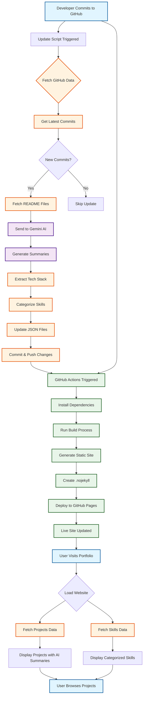
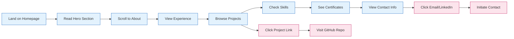
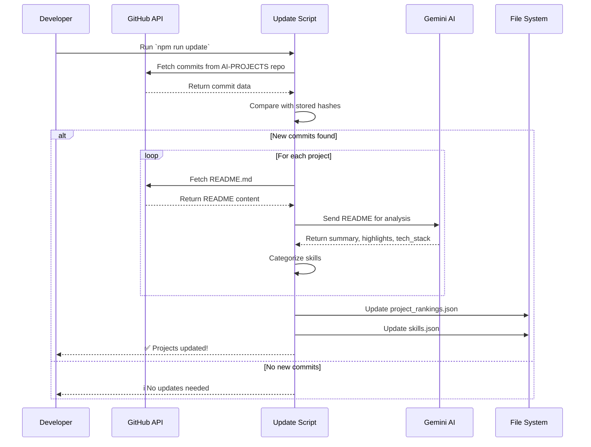
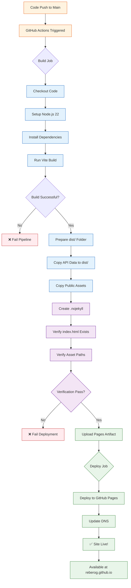
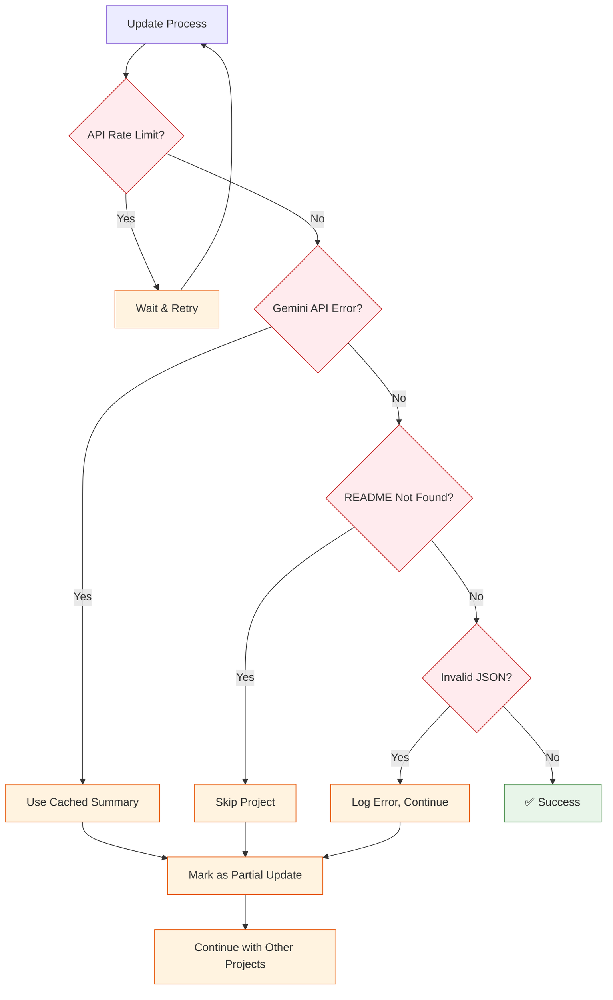
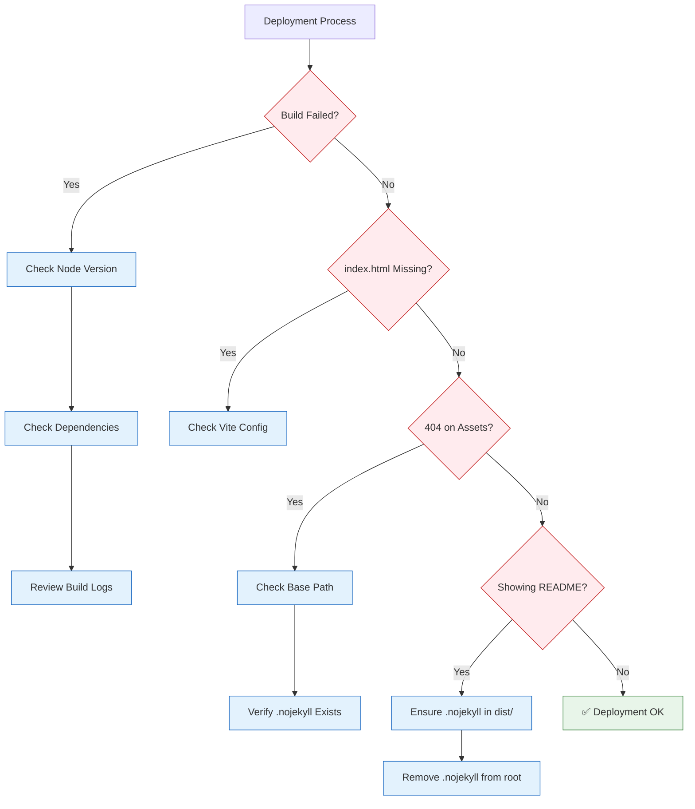

# Functional Architecture

This document describes the **functional architecture** of the portfolio application, focusing on user interactions, data flows, and system behavior from a high-level perspective.

---

## Overview

The portfolio is a self-updating, AI-powered web application that showcases projects and skills. It consists of three main functional areas:

1. **User-Facing Portfolio** - Public website displaying projects and information
2. **Auto-Update System** - Background process that syncs with GitHub and generates AI summaries
3. **Deployment Pipeline** - Automated CI/CD that builds and deploys the site

---

## System Flow Diagram

---

## Functional Components

### 1. User-Facing Portfolio

**Purpose:** Present professional profile, projects, and skills to visitors

**Key Features:**
- Responsive hero section with personal information
- Dynamic project cards with AI-generated summaries
- Categorized skills display
- Experience timeline
- Certificates showcase
- Contact information and social links

**User Journey:**

**Data Sources:**
- `public/api/project_rankings.json` - Project data with AI summaries
- `public/api/skills.json` - Categorized skills
- `src/routes/index.tsx` - Static content (experience, education, certificates)

---

### 2. Auto-Update System

**Purpose:** Keep project information current without manual intervention

**Workflow:**

**AI Processing:**
- **Input:** Project README.md content
- **Processing:** Gemini 1.5 Flash analyzes content
- **Output:**
  - `summary`: Brief project description (2-3 sentences)
  - `highlights`: Key features/achievements (array)
  - `tech_stack`: Technologies used (array)

**Skill Categorization:**
The system automatically categorizes technologies into:
- Languages (Python, JavaScript, TypeScript, etc.)
- AI/ML (TensorFlow, PyTorch, LangChain, etc.)
- Web Frameworks (React, Next.js, FastAPI, etc.)
- Databases (MongoDB, PostgreSQL, etc.)
- Cloud & DevOps (AWS, Docker, Kubernetes, etc.)
- Data Tools (Pandas, NumPy, etc.)
- Other (uncategorized)

---

### 3. Deployment Pipeline

**Purpose:** Automatically build and deploy updates

**Trigger Conditions:**
- Push to `main` branch
- Manual workflow dispatch

**Deployment Flow:**

**Key Steps:**
1. **Checkout & Setup:** Get code, configure Node.js 22
2. **Build:** Run `npm run build` to create static site
3. **Prepare:** 
   - Copy API data from `public/api/` to `dist/api/`
   - Copy other public assets (CNAME, etc.)
   - Create `.nojekyll` to bypass Jekyll processing
4. **Verify:**
   - Check `dist/index.html` exists
   - Verify asset paths are correct (`/assets/`)
5. **Deploy:** Upload artifact and deploy to GitHub Pages

---

## Data Flow

### Project Data Flow

```mermaid
flowchart LR
    A[GitHub Repo:<br/>AI-PROJECTS] --> B[Update Script]
    B --> C[Gemini AI API]
    C --> D[Generated Data]
    D --> E[public/api/<br/>project_rankings.json]
    E --> F[Vite Build]
    F --> G[dist/api/<br/>project_rankings.json]
    G --> H[GitHub Pages]
    H --> I[User Browser]
    I --> J[React Component]
    J --> K[Rendered Project Cards]
    
    classDef source fill:#e1f5ff,stroke:#01579b
    classDef process fill:#fff3e0,stroke:#e65100
    classDef storage fill:#f3e5f5,stroke:#6a1b9a
    classDef output fill:#e8f5e9,stroke:#2e7d32
    
    class A source
    class B,C,D,F process
    class E,G storage
    class H,I,J,K output
```

### Skills Data Flow

```mermaid
flowchart LR
    A[All Project<br/>Tech Stacks] --> B[Skill Aggregator]
    B --> C[Categorization Logic]
    C --> D[public/api/<br/>skills.json]
    D --> E[Vite Build]
    E --> F[dist/api/<br/>skills.json]
    F --> G[GitHub Pages]
    G --> H[User Browser]
    H --> I[Skills Component]
    I --> J[Categorized<br/>Skill Grid]
    
    classDef source fill:#e1f5ff,stroke:#01579b
    classDef process fill:#fff3e0,stroke:#e65100
    classDef storage fill:#f3e5f5,stroke:#6a1b9a
    classDef output fill:#e8f5e9,stroke:#2e7d32
    
    class A source
    class B,C,E process
    class D,F storage
    class G,H,I,J output
```

---

## Error Handling

### Update Script Errors

### Deployment Errors

---

## Key Functional Requirements

### Performance
- Initial page load < 3 seconds
- Smooth animations (60 FPS)
- Lazy load images
- Code splitting for routes

### Accessibility
- WCAG 2.1 Level AA compliance
- Keyboard navigation support
- Screen reader optimized
- High contrast support

### Reliability
- Graceful degradation if API fails
- Cached data fallback
- Error boundary protection
- Build verification before deploy

### Maintainability
- Automated updates (no manual JSON editing)
- Self-documenting code
- Consistent component patterns
- Comprehensive error logging

---

## Future Enhancements

### Planned Features
1. **Blog Integration** - Markdown-based blog posts
2. **Analytics Dashboard** - Visitor stats and engagement
3. **Dark/Light Theme Toggle** - User preference system
4. **Search Functionality** - Search projects and skills
5. **Project Filtering** - Filter by technology or category
6. **Performance Metrics** - Lighthouse scores in README

### Possible Integrations
- **LinkedIn API** - Auto-sync experience
- **Medium API** - Import blog posts
- **Google Analytics** - Track visitor behavior
- **EmailJS** - Contact form functionality

---

## Conclusion

This functional architecture provides a robust, maintainable, and user-friendly portfolio system. The combination of AI-powered updates, automated deployment, and modern web technologies ensures the site stays current with minimal manual intervention.

For technical implementation details, see [TECHNICAL_ARCHITECTURE.md](./TECHNICAL_ARCHITECTURE.md).
